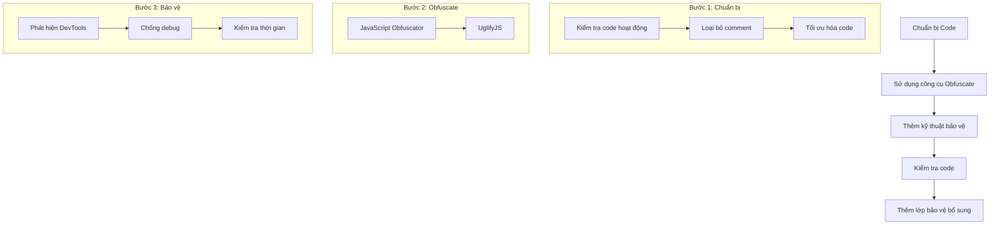

# Lịch sử trò chuyện về JavaScript Obfuscation

## Phân tích code đã được obfuscate

### File gốc: pdf_index.js

Đây là một file JavaScript đã được obfuscate (làm rối) để bảo vệ code và ngăn chặn việc mở DevTools (F12).

### Quy trình Obfuscate JavaScript



### Code đã được giải mã:

```javascript
// Hằng số và biến
const THRESHOLD = 160; // _0x40c57a
var state = 0; // _0x4622e5

// Hàm phát hiện DevTools
const emitDevToolsChange = (isOpen, orientation) => {
    globalThis.dispatchEvent(new globalThis.CustomEvent('devtoolschange', {
        detail: {
            isOpen: isOpen,
            orientation: orientation
        }
    }));
};

// Hàm kiểm tra DevTools
const checkDevTools = ({ debug: debug = true } = {}) => {
    const isVertical = globalThis.outerWidth - globalThis.innerWidth > THRESHOLD;
    const isHorizontal = globalThis.outerHeight - globalThis.innerHeight > THRESHOLD;
    const orientation = isVertical ? 'vertical' : 'horizontal';

    if (!(isHorizontal && isVertical) && 
        (globalThis.chrome && globalThis.chrome.app && globalThis.chrome.app.isInstalled || 
         isVertical || isHorizontal)) {
        emitDevToolsChange(true, orientation);
    } else {
        emitDevToolsChange(false, orientation);
    }
};

// Khởi tạo và chạy kiểm tra định kỳ
checkDevTools({ debug: false });
setInterval(checkDevTools, 500);

// Xử lý sự kiện khi trang web load xong
jQuery(document).ready(function() {
    window.addEventListener('keydown', event => {
        var isMobile = false;
        
        // Kiểm tra thiết bị di động
        if (/Android|webOS|iPhone|iPad|iPod|BlackBerry|IEMobile|Opera Mini/i.test(navigator.userAgent)) {
            isMobile = true;
        } else {
            isMobile = false;
        }

        // Xử lý phím F12
        if (event.location === 3 && !isMobile) {
            var element = document.getElementsByTagName('html')[0];
            if (typeof element != 'undefined') element.remove();
            state = -1;
        } else {
            var startTime = new Date();
            debugger;
            var endTime = new Date() - startTime;
            
            if (endTime > 100) {
                var element = document.getElementsByTagName('html')[0];
                if (typeof element != 'undefined') element.remove();
                state = -1;
            } else {
                if (state === 0) {
                    window.setTimeout(function() {
                        window.main ? window.setTimeout(function() {
                            main();
                        }, 250) : main();
                    }, 10);
                    state = 1;
                } else if (endTime === 0 && state < 0) {
                    window.location.reload();
                }
            }
        }
    });
});

// Hiển thị thông báo
console.log("%c \nVUI LÒNG TẮT F12 ĐỂ TIẾP TỤC ĐỌC SÁCH. \n%c", 
    'font-family: "Arial", Arial, sans-serif;font-size:35px;color:red;-webkit-text-fill-color:red;-webkit-text-stroke: 1px red;', 
    "font-size:35px;color:red;"
);

console.log("%c \nĐể bảo vệ quyền lợi cho nhà phát hành và khách hàng, vui lòng tắt F12 để có thể tiếp tục đọc sách, chúc bạn đọc sách vui vẻ ! \n%c", 
    'font-family: "Helvetica Neue", Helvetica, Arial, sans-serif;font-size:16px;color:#515152;-webkit-text-fill-color:#515152;-webkit-text-stroke: 1px #515152;', 
    "font-size:16px;color:#515152;"
);
```

## Hướng dẫn Obfuscate JavaScript

### Các bước thực hiện:

1. **Bước 1: Chuẩn bị code** 📝
   - ✅ Đảm bảo code hoạt động tốt trước khi obfuscate
   - ✅ Loại bỏ các comment không cần thiết
   - ✅ Tối ưu hóa code nếu có thể

2. **Bước 2: Sử dụng công cụ obfuscate** 🛠️
   Có một số công cụ phổ biến:
   - 🔧 JavaScript Obfuscator Tool (https://obfuscator.io/)
   - 🔧 UglifyJS (thông qua npm)

3. **Bước 3: Thêm các kỹ thuật bảo vệ bổ sung** 🛡️
   - 🚫 Phát hiện DevTools
   - 🚫 Chống debug
   - ⏱️ Kiểm tra thời gian thực thi

4. **Bước 4: Kiểm tra code sau khi obfuscate** ✅
   - 🧪 Chạy thử code
   - 🔍 Kiểm tra các tính năng bảo vệ
   - 📦 Tối ưu hóa kích thước file

5. **Bước 5: Thêm các lớp bảo vệ bổ sung** 🔒
   - 🔐 Mã hóa các chuỗi quan trọng
   - 🎭 Thêm các biến giả
   - 🎭 Thêm các hàm giả
   - 🔄 Thêm các điều kiện kiểm tra phức tạp

### Ví dụ về các kỹ thuật obfuscate:

```javascript
// 1. Đổi tên biến
const _0x40c57a = 160;
var _0x4622e5 = 0;

// 2. Chuyển đổi chuỗi thành mảng
const _0x23b653 = ['8168nHeODb', 'undefined', '463970qTdULP', 'devtoolschange'];

// 3. Thêm code giả
function _0x16b0() {
    return ['8168nHeODb', 'undefined', '463970qTdULP', 'devtoolschange'];
}

// 4. Làm phẳng luồng điều khiển
while (!![]) {
    try {
        // Code thật
        break;
    } catch (_0x4a9f5c) {
        // Code giả
    }
}
```

### Lưu ý quan trọng: ⚠️

| Lưu ý | Mô tả |
|-------|--------|
| 🔒 Bảo mật | Obfuscate không phải là mã hóa, nó chỉ làm code khó đọc hơn |
| 🚫 Thông tin nhạy cảm | Không nên lưu trữ thông tin nhạy cảm trong code JavaScript |
| ⚖️ Cân bằng | Cân nhắc giữa mức độ bảo mật và hiệu suất |
| 💾 Sao lưu | Luôn giữ một bản copy code gốc |
| 🧪 Kiểm thử | Test kỹ code sau khi obfuscate |

### Các công cụ hỗ trợ: 🛠️

- [JavaScript Obfuscator Tool](https://obfuscator.io/)
- [UglifyJS](https://github.com/mishoo/UglifyJS)
- [Terser](https://github.com/terser/terser)
- [Babel](https://babeljs.io/)

### Tài liệu tham khảo: 📚

- [MDN Web Docs](https://developer.mozilla.org/)
- [JavaScript.info](https://javascript.info/)
- [Obfuscator.io Documentation](https://github.com/javascript-obfuscator/javascript-obfuscator) 